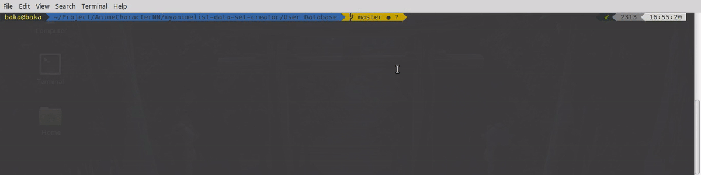
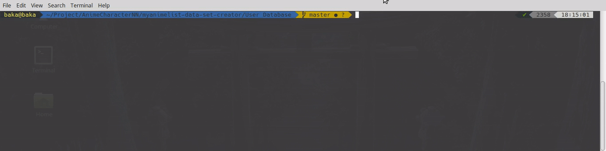

# How to use

This script can be used to download user dataset from [**Myanimelist**](https://myanimelist.net/) using an API, [**Kuristina**](https://github.com/TimboKZ/kuristina).

#### Column metadata:

* userID: MAL user ID
* animeID: id of anime as in anime url https://myanimelist.net/anime/ID
* score: score by the use for anime with id = animeID (if user haven't score the anime then this field is 0).

#### Syntax
```
python getUser.py UserList.txt [User.csv]
```

**NOTE**: Make sure you have a **Userlist.txt** file containing the name of the users. If you don't have that then use the scrapper([scrap from club]() or [scrap from post]()).

#### How to create User List from forum post:
For this you need to get topic ID.
Go to [**MAL**](https://myanimelist.net/) -> [**Community** -> **Forums**](https://myanimelist.net/forum/) -> **Select a forum**

For example for the following forums links their respective ID are highlighted in bold below:

[https://myanimelist.net/forum/?topicid=1699126](https://myanimelist.net/forum/?topicid=1699126) -> **1699126**

[https://myanimelist.net/forum/?topicid=1696289](https://myanimelist.net/forum/?topicid=1696289) -> **1696289**

After getting the topic ID, you can use **createUserListFromPost** script.

###### Syntax:
```
python createUserListFromPost.py topicID [UserList.txt]
```

#### How to create User List from club:
For this you need to get club ID.
Go to [**MAL**](https://myanimelist.net/) -> [**Community** -> **Clubs**](https://myanimelist.net/forum/) -> **Select a club**

For example for the following clubs links their respective ID are highlighted in red below:

[https://myanimelist.net/clubs.php?cid=72250](https://myanimelist.net/clubs.php?cid=72250) -> **72250**

[https://myanimelist.net/clubs.php?cid=32683](https://myanimelist.net/clubs.php?cid=32683) -> **32683**

After getting the topic ID, you can use **createUserListFromClub** script.

###### Syntax:
```
python createUserListFromClub.py clubID [UserList.txt]
```

#### Demo:

###### Create User List from forum



###### Create User List from club


###### Get user dataset

